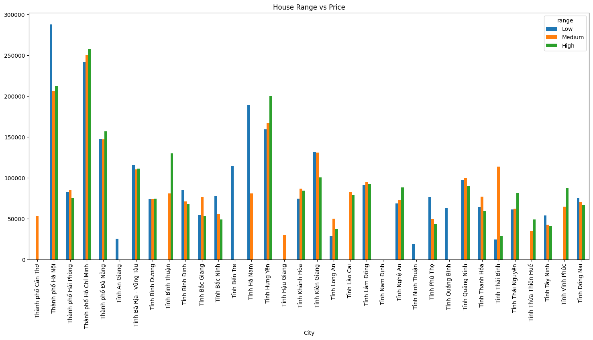
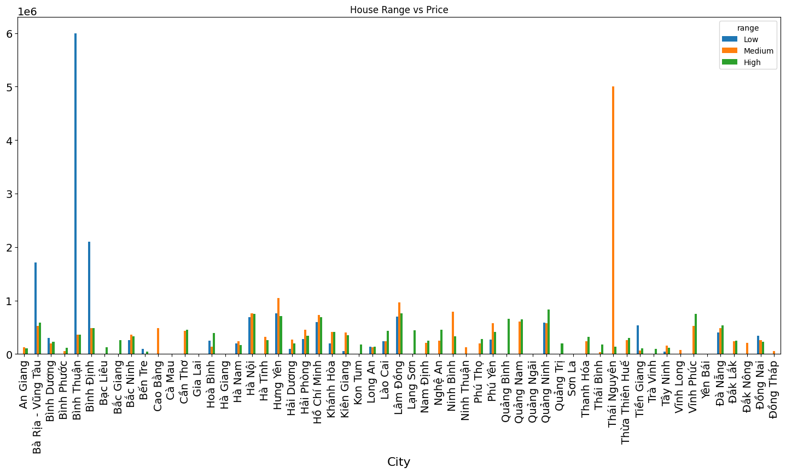
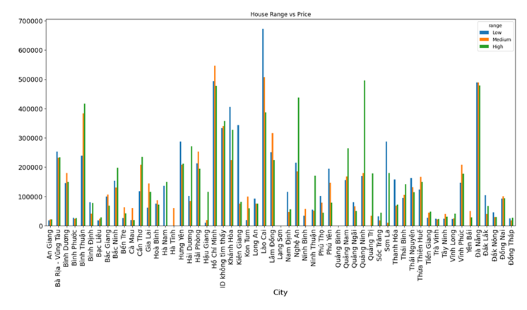
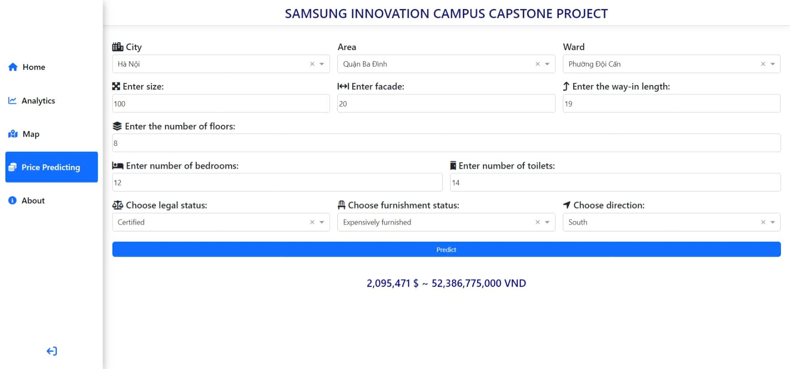
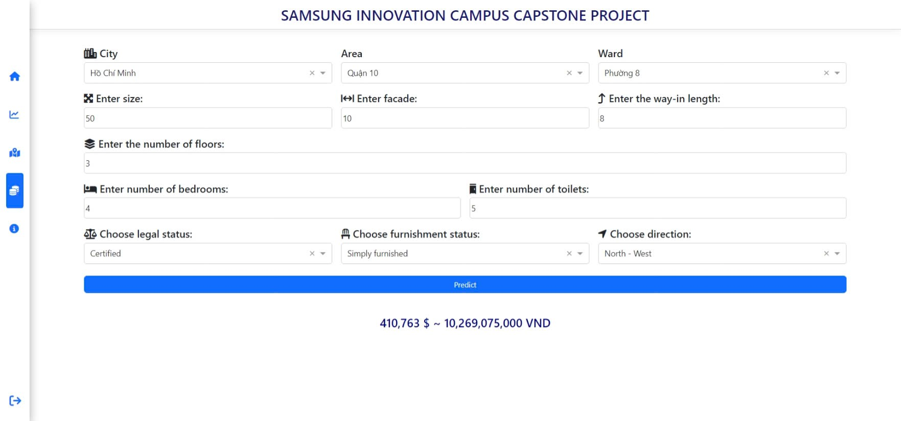

# Real estate price prediction

This project focuses on building a predictive model for real estate prices in Vietnam using data collected from popular real estate websites ([batdongsan.com.vn](https://batdongsan.com.vn/), [nhatot.com](https://www.nhatot.com/)). It includes web crawling, machine learning model training, and deploying an interactive web application using Dash (Python).

!!!!!!!! We've just done forecasting house prices. !!!!!!!!

## Analytics

### Apartments

### House

### Land

## Result

